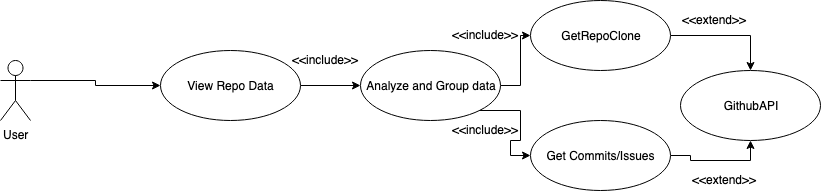
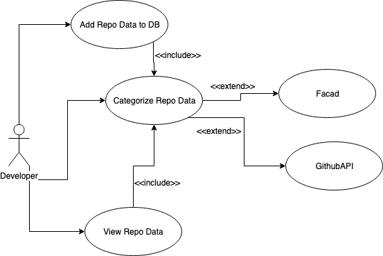
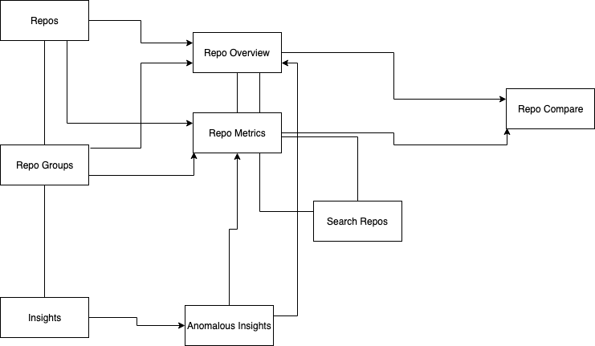

# Software Requirements Specification for Augur
### by: Graeson Bullington

## Introduction
* Community Health Analytics Open Source Software (CHAOSS) is a group of important Open Source Software Health and Sustainability tools that can allow you to develop software tools to help you express open sourced projects health and supportability. The goal of CHAOSS is to allow for a more permeable solution and appealable way for assessing the different metrics within open sourced projects and the community that they have built around them.
* The Software Requirements Specification that I will be speaking on will be about the Augur project within the CHAOSS project. Augur is an open sourced tool that allows open sourced projects to track all of the changes made to a repository. This is important to track the health of an open sourced project.

## Software Product Overview
* The overview of Augur is to be able to provide metrics about repositories about the changes that have been made to the open sourced reposititories. This is extremely important data to track because you always want anybody to make changes to an open sourced project if applicable. You don't just want people associated with the organization or sponsored by the open sourced project to contribute to it. Augur is an important tool because it allows you to show statistics that are related to your projects and can be super useful for the communities managers to keep track of who is committing and if their commits are being merged and how they're related to the project. These metrics can be downloaded and compared to other open sourced projects, allowing the community managers to have a vast comparison of their projects to others. 

## System Use
* Augur allows us to take the commit data of open sourced projects and display them in a neat manner on a .csv document. This allows users to be able to compare their repository data compared to other repositories and make judgements based off of the data obtained. This allows all of the data from repositories to be stored in a location that is publicly viewable. Also, this project allows us to organize the data obtained and give a display that is more user-friendly or manager-friendly. Augur uses Github API to be able to call certain repo data for the open sourced repositories. Also, another aspect of Augur is that it downloads the repos and analyzes the commits and issues and can display that on a document for users to see.

## Actor Survey

### Developer
* The developers are responsible for creating API endpoints and a user interface to allow users to be able to visualize data that have been made about their repositories. They are also responsible in analyzing repos that they have forked and try to check to see what changes have been made and when they were made to the repositories. Then they can use the information that they found to create graphs to show the metrics that they have found on the repositories.

### Community Managers
* Community Managers use this data to help determine the healthiness and sustainability of their repositories. They are able to do this by going onto the website created by Augur developers and checking the graphs that display the data about their repos. They can use this information to compare their repositories to other projects and determine the actions they need to take to keep their community healthy.

### Other Users
* The rest of the users can use data from Augur to make sure that the repo that they are using is in a healthy state. This meaning that there are multiple different groups of people contributing to the project, making sure that people other than sponsors are contributing to the repo as well, and making sure that they are accepting commits from outside resources. Theses other users can use this data to determine if using a certain open sourced project for their software would be a good commitment.

### Use Case User Diagram

### Use Case Developer Diagram

## System Functional Requirements

### User Interface
* Augur is a web application that allows its user to access databases and visualize the data that has been gathered for the repositories. Typically within Augur, all users will have to make queries to the web interface, that are then ran by the server to give them the data that they are looking for. Users will be able to search any given repository and view certains data compiled by the Augur project and project them under certain categories. Depending on the data that you want to view, you could download the graphs to help display the information locally, rather than wait for the API calls to be made which for some reason are taking about 10 minutes for me. You can look at the different repo groups that display data about the different commits to the repositories in that group.

## Non Functional Requirements
* Users must be able to operate a PC and looking up websites
* Users must also be able to understand Github and the different terms that are used by the Github community.
* Users must have a tool that is able to open .csv docs. For example, google docs, Microsoft Excel, and other documents for displaying data. 
* If you choose to use Augur through the command line interface then you must have an understanding of SQL queries and 
* Also, you'll need knowledge of different system administration tools so that you can setup the system through CLI.

## Design Constraints
* Augur is that to access the web interface, you will need to be on one of the main web browsing software that comes with your operating system. ie) Edge, Chrome, or Safari
* If you're installing Augur to query data that way, you will need PostgreSQL 10 or higher. 
* For the backend, you'll need the Github Access Token and Python 3.6 or higher because it uses Python REST API calls and uses API calls from github for the repo data. 
* For the frontend, you'll need Vue.js, vue-cli, node, and npm to be able to run all of the necesities needed for the website.
* Also, another design constraint I noticed is that when I went to the website, none of the data loaded that I wanted to. It was taking like 10 minutes to load.
* Another design constraint is that when I click on the insights tab, and try to dig further into a repo, the pop up message covers the button and makes it hard to click on the data needed 

## Purchased Components
* Dell PowerEdge R630 Server - The server is needed because thats where all of the querying from the website will be done on. So we have to make sure to have enough CPU cores to distribute the work among cores. Enough storage so that the data can be stored on the machine via databases and not run out of space. Im thinking about 10 TB of space to start. Depending on the amount of users, you would need at minimum 2GB of RAM per every 200 visits per day.

## Interface

